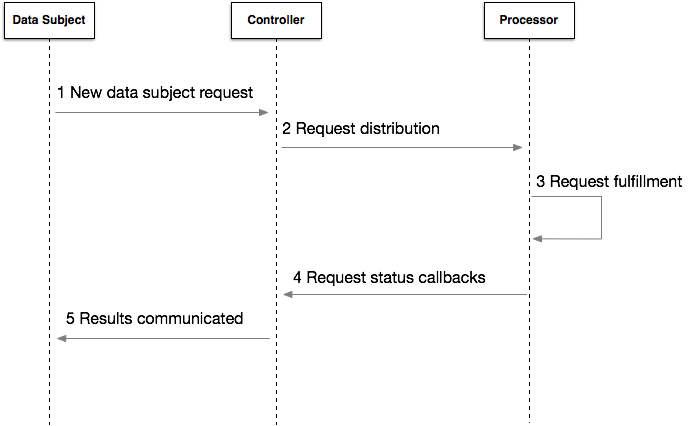

# OpenGDPR

An open specification for data subject request management.

### Version 0.1.4

### Abstract

This document defines a common specification for Data Controllers and Processors to
build interoperable systems for tracking and honoring Data Subject Rights requests
to support the accountability principle as defined under the General Data
Protection Regulation (GDPR).

It defines roles, responsibilities, objects and protocols that Data Controllers
and Processors can utilize to distribute, fulfill and report the status of a range
of Data Subject request types.

For more information on the Data Subject Rights, [see chapter 3 of the GDPR
legislation](https://eur-lex.europa.eu/legal-content/EN/TXT/PDF/?uri=CELEX:32016R0679&from=EN).

## 1. Introduction

This specification is intended to:
- Provide a well defined JSON specification that allows Controllers and Processors to communicate and
manage Data Subject access, portability and erasure requests in a uniform and scalable
manner.
- Provide strong cryptographic verification of request receipts to provide chain of
processing assurance and demonstrate accountability to regulatory authorities (Article
5.2).
- Provide for a callback mechanism to enable Controllers to identify the status of
all Data Subject requests.

This specification does not cover:

- Defining the technical measures to describe the fulfill of Data Subject requests.
It is the responsibility of each Data Controller and Data Processor to interpret and
apply the GDPR to honor Data Subject requests (Chapter 3).
- The protocol for communications between Controllers and Data Subjects.
- The protocol for communications between Controllers or Processors and Supervisory
Authorities.
- The protocol for communication of the results of an access or portability request.

### 1.1.  Notational Conventions
- The key words "MUST", "MUST NOT", "REQUIRED", "SHALL", "SHALL NOT", "SHOULD",
"SHOULD NOT", "RECOMMENDED", "MAY", and "OPTIONAL" in this document are to be
interpreted as described in [RFC2119].
- Global Unique Identifiers (GUID) **MUST** be lowercase and v4 format.


## 2. Terms and Definitions

#### Data Subject Request

A request from a Data Subject exercising their Data Subject Rights as defined within the GDPR under Chapter 3.

#### Fulfillment

Enacting compliance related activities to honor an OpenGDPR request.

## 3. OpenGDPR Basics

### 3.1. Roles and Responsibilities

#### Data Subject

  A European Union resident whose personal data is being processed.

#### Data Controller

  An entity which makes the decision about what personal data  will be processed and the types of processing that will be done with respect to that personal data. The Data Controller receives Data Subject requests from the Data Subjects and validates them. The Data Controller **SHOULD** provide a callback endpoint. The Data Controller **SHOULD** verify response signatures. Referenced as "Controller."

#### Data Processor

  The organization that processes data pursuant to the instructions of the Controller on behalf of the Controller. The Data Processor receives data subject requests via RESTful endpoints and is responsible for fulfilling requests. The Data Processor **MUST** provide a signed response to requests. The Data Processor **MUST** honor callbacks.  Data Processors **MUST** honor callbacks included in requests.

  Processors **MUST** provide the following endpoints:

  - `/discovery`
  - `/status`
  - `/opengdpr_requests`

### 3.2.  Protocol Flow



*Figure 1. Request Sequence Flow*

The flow illustrated in figure 1 includes the following steps:

1. A new data subject request submitted to the Controller
2. Controller verifies the request and submits it to Processors
3. Processor fulfills request
4. Processor reports status to the Controller via callbacks
5. Controller reports back to the Data Subject

### 3.3.  Transport

Whenever Transport Layer Security (TLS) is used by this specification, the appropriate version (or versions) of TLS will vary over time, based on the
widespread deployment and known security vulnerabilities. Implementations **MAY** also support additional transport layer security mechanisms that meet an individual party’s (e.g. Controller or Processor) security requirements.

## 4. Security

### 4.1. Certificates

Digital certificates used in this protocol **MUST** be issued by a trusted
certificate authority and **MUST** be issued to the organization issuing the
callback. A self-signed certificate **MUST** not be used.

### 4.2. Signing

Digital signatures **MUST** be generated and validated according to the Digital
Signature Standard FIPS PUB 186-4: https://nvlpubs.nist.gov/nistpubs/FIPS/NIST.FIPS.186-4.pdf

### 4.3.  Authentication

API authentication for OpenGDPR requests is out of scope for this document, and is left to the Processor to implement. Callbacks **MUST** be authenticated by a digital signature issued by the certificate detailed in section 4.1.

## 5. Identities

The identity types and schema documented below are reused throughout all OpenGDPR API contracts.

### 5.1.  Identity Type Keys

The following identity type keys are supported:

```
controller_customer_id
android_advertising_id
android_id
email
fire_advertising_id
ios_advertising_id
ios_vendor_id
microsoft_advertising_id
microsoft_publisher_id
roku_publisher_id
roku_advertising_id
```

### 5.2 Identity Formats

The following identity formats are supported:

```
raw
sha1
md5
sha256
```

### 5.3. Identity Object

An OpenGDPR request **MUST** contain one or more Identity objects used to fulfill
the request. An Identity object contains the following properties:

- `identity_type`

  **REQUIRED** string value representing the form of identity. Supported values: See section 5.1.

- `identity_value`

  **REQUIRED** string value representing the identity. This does not apply to discovery response objects.

- `identity_format`

  **REQUIRED** string value representing the encoding of the identity. Supported values: See section 5.2.

## 6. OpenGDPR Discovery

OpenGDPR service implementations **MUST** provide an endpoint that describes their support for the OpenGDPR specification via HTTP GET.

## 6.1.  Example Discovery Request

```http
GET /discovery HTTP/1.1
Host: example-processor.com
Accept: application/json
```

### 6.2. Subject Request Types

The following subject request types are supported:

```
access
portability
erasure
```

### 6.3.  Discovery Response Properties

`api_version`

  **REQUIRED** version string representing the supported version of the OpenGDPR API.

 `supported_identities`

  **REQUIRED** array of "identity_type" and "identity_format" pairs.

`supported_subject_request_types`

   **REQUIRED** array of "subject_request_type" strings as defined in 6.2.

`processor_certificate`

  **REQUIRED** HTTP endpoint x.509 where certificate used to sign callbacks and OpenGDPR API responses can be downloaded. The domain **MUST** match that of the discovery callback.

### 6.4.  Example Discovery Response

```http
HTTP/1.1 200 OK
Content-Type: application/json
{
   "api_version":"0.1",
   "supported_identities":[
      {
         "identity_type":"email",
         "identity_format":"raw"
      },
      {
         "identity_type":"email",
         "identity_format":"sha256"
      }
   ],
   "supported_subject_request_types":[
      "erasure"
   ],
   "processor_certificate":"https://exampleprocessor.com/cert.pem"
}
```

## 7. OpenGDPR Request

### 7.1.1 OpenGDPR Request Properties

OpenGDPR service implementations **MUST** provide an endpoint that creates OpenGDPR JSON requests via HTTP POST. Controllers **MUST** submit requests with the following parameters:

`subject_request_id`

  **REQUIRED** UUID v4 string. This **MUST** be generated by the Controller at the time of request submission to a Processor.

`subject_request_type`

  **REQUIRED** string value representing the type of OpenGDPR Request. Supported values: "erasure", "portability", "access"

`subject_identities`

  **REQUIRED** array of Identity objects as specified in section 5.3. This is optional if identities are included in the `extensions` section.

`submitted_time`

   **REQUIRED** RFC 3339 date string representing the time of the original request by the data subject.

`api_version`

  **OPTIONAL** Version string representing the desired version of the OpenGDPR API.

`status_callback_urls`

  **OPTIONAL** Array of urls to be invoked by the Processor on subject_request_status change. This array **SHOULD** be included to avoid polling.

`extensions`

  **OPTIONAL** Processor-id-keyed object representing processor-specific elements in the request. See 7.1.2 below.

#### 7.1.2 Extensions

OpenGDPR requests may contain an `extensions` object, composed of a series of child-objects, keyed by a processor domain.

- The domain of each extension **MUST** match the processor's OpenGDPR domain, matching the `X-OpenGDPR-Processor-Domain` header in OpenGDPR responses.
- Extensions **MUST** not be used for or contain authentication information.
- Processors **MUST** only implement an extension for items that do not already fit into the generic spec.

[Currently known extensions can be found here](OpenGDPR_extensions.md).

### 7.2.  Example OpenGDPR Request

```http
POST /opengdpr_requests HTTP/1.1
Host: example-processor.com
Accept: application/json
Content-Type: application/json
{
  "subject_request_id": "a7551968-d5d6-44b2-9831-815ac9017798",
  "subject_request_type": "erasure",
  "submitted_time": "2018-10-02T15:00:00Z",
  "subject_identities": [
    {
      "identity_type": "email",
      "identity_value": "johndoe@example.com",
      "identity_format": "raw"
    }
  ],
  "api_version": "0.1",
  "status_callback_urls": [
    "https://examplecontroller.com/opengdpr_callbacks"
  ],
  "extensions": {
    "example-processor.com": {
      "foo-processor-custom-id":123456,
      "property_id": "123456",
    },
    "example-other-processor.com": {
      "foo-other-processor-custom-id":654321
    }
  }
}
```


### 7.3.  OpenGDPR Response Properties

For well formed requests, the OpenGDPR service **MUST** respond with HTTP status
code 201 and it **MUST** include the following parameters:

`controller_id`

  **REQUIRED** string indicating the unique identity of the Controller in the Processor’s system.

`expected_completion_time`

  **REQUIRED** RFC 3339 date string representing the time when the Processor expects to fulfill the request.

`received_time`

  **REQUIRED** RFC 3339 date string representing the time when the Processor received the request.

`encoded_request`

  **REQUIRED** Base64 encoding of the entire body of the OpenGDPR request. Controllers **MUST** not log or store this.

`subject_request_id`

  **REQUIRED** UUID v4 string from the originating OpenGDPR request.

`processor_signature`

  **REQUIRED** Base64 encoded signature of the SHA 256 digest of the body of the response.

### 7.4.  Example OpenGDPR Response

```http
HTTP/1.1 201 Created
Content-Type: application/json
X-OpenGDPR-Processor-Domain: example-processor.com
X-OpenGDPR-Signature:
kiGlog3PdQx+FQmB8wYwFC1fekbJG7Dm9WdqgmXc9uKkFRSM4uPzylLi7j083461xLZ+mUloo3tpsmyI
Zpt5eMfgo7ejXPh6lqB4ZgCnN6+1b6Q3NoNcn/+11UOrvmDj772wvg6uIAFzsSVSjMQxRs8LAmHqFO4c
F2pbuoPuK2diHOixxLj6+t97q0nZM7u3wmgkwF9EHIo3C6G1SI04/odvyY/VdMZgj3H1fLnz+X5rc42/
wU4974u3iBrKgUnv0fcB4YB+L6Q3GsMbmYzuAbe0HpVA17ud/bVoyQZAkrW2yoSy1x4Ts6XKba6pLifI
Hf446Bubsf5r7x1kg6Eo7B8zur666NyWOYrglkOzU4IYO8ifJFRZZXazOgk7ggn9obEd78GBc3kjKKZd
waCrLx7WV5y9TMDCf+2FILOJM/MwTUy1dLZiaFHhGdzld2AjbjK1CfVzyPssch0iQYYtbR49GhumvkYl
11S4oDfu0c3t/xUCZWg0hoR3XL3B7NjcrlrQinB1KbyTNZccKR0F4Lk9fDgwTVkrAg152UqPyzXxpdzX
jfkDkSEgAevXQwVJWBNf18bMIEgdH2usF/XauQoyrne7rcMIWBISPgtBPj3mhcrwscjGVsxqJva8KCVC
KD/4Axmo9DISib5/7A6uczJxQG2Bcrdj++vQqK2succ=
{
    "controller_id":"example_controller_id",
    "expected_completion_time":"2018-11-01T15:00:01Z",
    "received_time":"2018 10 02T15:00:01Z",
    "encoded_request":"<BASE64 ENCODED REQUEST>",
    "subject_request_id":"a7551968-d5d6-44b2-9831-815ac9017798"
}
```

### 7.5.  OpenGDPR Error Response Properties

For errors, the OpenGDPR service **MUST** respond with HTTP status code 400 and
**SHOULD** include the following parameters:

`error`

  **OPTIONAL** Common error object as defined in section 7.6.

### 7.6.  Error Object

Processors **SHOULD** include descriptive error responses. Error
responses **MUST** not contain sensitive information related to user identity or
authentication.

`code`

  **REQUIRED** Integer code indicating the HTTP status of the response.

`message`

  **OPTIONAL** String description of the issue that was encountered.

`errors`

  **OPTIONAL** array of the error detail objects including the following fields: "message" "domain", "reason".

## 7.7.  Example OpenGDPR Error Response

```http
HTTP/1.1 400 Bad Request
Content-Type: application/json;charset=UTF-8
Cache Control: no store
Pragma: no cache
{
  "error": {
    "code": 400,
    "message": "subject_request_id field is required",
    "errors": [
      {
        "domain": "Validation",
        "reason": "IllegalArgumentException",
        "message": "subject_request_id field is required."
      }
    ]
  }
}
```

## 8. OpenGDPR Status

OpenGDPR requests **MUST** have an associated status. The following request statuses
are supported:

 `pending`

 Indicates that a well formed request has been received by the Processor.

`in_progress`

Indicates that a request is currently being acted on. Processors **SHOULD** indicate this request if possible.

`completed`

Indicates that a request has been fulfilled.

`cancelled`

Indicates that a request has been cancelled.

### 8.1.  Request Status Endpoint

OpenGDPR endpoints **MUST** be queryable for request status via an HTTP GET for the
`subject_request_id`.

### 8.2.  Example Status Request

```http
GET /opengdpr_requests/a7551968-d5d6-44b2-9831-815ac9017798 HTTP/1.1
Host: example-processor.com
Accept: application/json
```

### 8.3.  Status Response Properties

The Status response **MUST** include the following headers:

`X-OpenGDPR-Processor-Domain`

  **REQUIRED** header representing the domain for which the signing
  certificate is issued. The domain name **MUST** match the domain on which
  OpenGDPR requests are received.

`X-OpenGDPR-Signature`

  **REQUIRED** header Base64 encoded signature generated by a certificate
  matching the domain in the `X-OpenGDPR-Processor-Domain` header.

The Status body **MUST** include the following properties:

`controller_id`

  **REQUIRED** string indicating the unique identity of the Controller in the
  Processor’s system.

`expected_completion_time`

  **REQUIRED** RFC 3339 date string representing the time when the
  Processor expects to fulfill the request.

`subject_request_id`

  **REQUIRED** UUID v4 string matching the original OpenGDPR request.

`request_status`

  **REQUIRED** string indicating the status of the request as defined in section 8.

`api_version`

  **OPTIONAL** Version string representing the desired version of the OpenGDPR API

`results_url`

  **OPTIONAL** A valid URL where the results of the request are available.


### 8.4.  Example Status Response

```http
HTTP/1.1 200 OK
Content-Type: application/json
X-OpenGDPR-Processor-Domain: example-processor.com
X-OpenGDPR-Signature:
kiGlog3PdQx+FQmB8wYwFC1fekbJG7Dm9WdqgmXc9uKkFRSM4uPzylLi7j083461xLZ+mUloo3tpsmyI
Zpt5eMfgo7ejXPh6lqB4ZgCnN6+1b6Q3NoNcn/+11UOrvmDj772wvg6uIAFzsSVSjMQxRs8LAmHqFO4c
F2pbuoPuK2diHOixxLj6+t97q0nZM7u3wmgkwF9EHIo3C6G1SI04/odvyY/VdMZgj3H1fLnz+X5rc42/
wU4974u3iBrKgUnv0fcB4YB+L6Q3GsMbmYzuAbe0HpVA17ud/bVoyQZAkrW2yoSy1x4Ts6XKba6pLifI
Hf446Bubsf5r7x1kg6Eo7B8zur666NyWOYrglkOzU4IYO8ifJFRZZXazOgk7ggn9obEd78GBc3kjKKZd
waCrLx7WV5y9TMDCf+2FILOJM/MwTUy1dLZiaFHhGdzld2AjbjK1CfVzyPssch0iQYYtbR49GhumvkYl
11S4oDfu0c3t/xUCZWg0hoR3XL3B7NjcrlrQinB1KbyTNZccKR0F4Lk9fDgwTVkrAg152UqPyzXxpdzX
jfkDkSEgAevXQwVJWBNf18bMIEgdH2usF/XauQoyrne7rcMIWBISPgtBPj3mhcrwscjGVsxqJva8KCVC
KD/4Axmo9DISib5/7A6uczJxQG2Bcrdj++vQqK2succ=
{
    "controller_id":"example_controller_id",
    "expected_completion_time":"2018-11-01T15:00:01Z",
    "subject_request_id":"a7551968-d5d6-44b2-9831-815ac9017798",
    "request_status":"pending",
    "api_version":"0.1",
    "results_url":"https://exampleprocessor.com/secure/d188d4ba-12db-48a0-898c-cd0f8ba7b345"
}
```

### 8.5. Request Status Callback

OpenGDPR requests **SHOULD** contain `status_callback_urls` (see section 7.1). The
following rules govern their use:
   - All included callbacks **MUST** be invoked by the Processor on request state
  change.
   - Processors **MUST** try to send callbacks at least once. It is recommended but
  not **REQUIRED** to retry callbacks when they have failed.
   - Controllers **SHOULD** make all reasonable effort towards a reliable callback
  system.
   - Processors **SHOULD** monitor for failed callback requests and notify affected
  Controllers.
   - Controllers **SHOULD** authenticate the validity of the callback.

## 8.6. Callback Request

Callbacks **MUST** include the following headers:

`X-OpenGDPR-Processor-Domain`

  **REQUIRED** header representing the domain for which the signing
  certificate is issued. The domain name **MUST** match the domain on which
  OpenGDPR requests are received.

`X-OpenGDPR-Signature`

  **REQUIRED** header Base64 encoded signature generated by a certificate
  matching the domain in the X-OpenGDPR-Processor-Domain header.

The callback body **MUST** include the following parameters:
`controller_id`

  **REQUIRED** string indicating the unique identity of the Controller in the
  Processor's system.

`status_callback_url`

  **REQUIRED** string matching the callback URL from the OpenGDPR request, see section 8.

`subject_request_id`

  **REQUIRED** UUID v4 string matching the original OpenGDPR request.

`request_status`

  **REQUIRED** string indicating the status of the request. See section 8.

`expected_completion_time`

  **REQUIRED** RFC 3339 date string representing the time when the Processor expects to fulfill the request.

`results_url`

  **OPTIONAL** A valid URL where the results of the request are available.

### 8.7. Callback Request Example

```http
POST /opengdpr_callbacks HTTP/1.1
Host: examplecontroller.com
Content-Type: application/json
X-OpenGDPR-Processor-Domain: example-processor.com
X-OpenGDPR-Signature:
kiGlog3PdQx+FQmB8wYwFC1fekbJG7Dm9WdqgmXc9uKkFRSM4uPzylLi7j083461xLZ+mUloo3tpsmyI
Zpt5eMfgo7ejXPh6lqB4ZgCnN6+1b6Q3NoNcn/+11UOrvmDj772wvg6uIAFzsSVSjMQxRs8LAmHqFO4c
F2pbuoPuK2diHOixxLj6+t97q0nZM7u3wmgkwF9EHIo3C6G1SI04/odvyY/VdMZgj3H1fLnz+X5rc42/
wU4974u3iBrKgUnv0fcB4YB+L6Q3GsMbmYzuAbe0HpVA17ud/bVoyQZAkrW2yoSy1x4Ts6XKba6pLifI
Hf446Bubsf5r7x1kg6Eo7B8zur666NyWOYrglkOzU4IYO8ifJFRZZXazOgk7ggn9obEd78GBc3kjKKZd
waCrLx7WV5y9TMDCf+2FILOJM/MwTUy1dLZiaFHhGdzld2AjbjK1CfVzyPssch0iQYYtbR49GhumvkYl
11S4oDfu0c3t/xUCZWg0hoR3XL3B7NjcrlrQinB1KbyTNZccKR0F4Lk9fDgwTVkrAg152UqPyzXxpdzX
jfkDkSEgAevXQwVJWBNf18bMIEgdH2usF/XauQoyrne7rcMIWBISPgtBPj3mhcrwscjGVsxqJva8KCVC
KD/4Axmo9DISib5/7A6uczJxQG2Bcrdj++vQqK2succ=
{
    "controller_id":"example_controller_id",
    "expected_completion_time":"2018-11-01T15:00:01Z",
    "status_callback_url":"https://examplecontroller.com/opengdpr_callbacks",
    "subject_request_id":"a7551968-d5d6-44b2-9831-815ac9017798",
    "request_status":"pending",
    "results_url":"https://exampleprocessor.com/secure/d188d4ba-12db-48a0-898c-cd0f8ba7b345"
}
```

### 8.8. Callback Authentication

In order to authenticate a callback, a Party **SHOULD** perform the following actions:
1. Read the X-OpenGDPR-Processor-Domain request header.
2. Fetch the public key from a cache based on identity.
3. If not present in cache, make a call to /discovery of the caller and cache the public key.  The Party performing authentication **MAY** whitelist allowed
endpoints.
4. Validate that the signature in the X-OpenGDPR-Signature header is valid for the body of the request.  The Party **SHOULD** NOT parse the payload until the signature
has been validated, but rather pass the raw contents into the signature validation function.
5. Return 403 if validation fails.
6. Verify the status_callback_url matches the Party's own endpoint. Return if this check fails.

## 9.  Cancellation Endpoint
OpenGDPR endpoints **MUST** accept request cancellations via an HTTP DELETE for the subject_request_id. OpenGDPR requests **MAY** be cancelled by the Controller while in status "pending".

### 9.1.  Example Cancellation Request

```http
DELETE /opengdpr_requests/a7551968-d5d6-44b2-9831-815ac9017798 HTTP/1.1
Host: example-processor.com
Accept: application/json
```

### 9.2.  Cancellation Response Properties
For well formed requests, the OpenGDPR service **MUST** respond with HTTP status
code 202, and the following parameters:

`controller_id`

  **REQUIRED** string indicating the unique identity of the Controller in the
  Processor's system.

`received_time`

  **REQUIRED** RFC 3339 date string representing the time when the Processor received the cancellation request.

`subject_request_id`

  **REQUIRED** UUID v4 string from the originating OpenGDPR request.

`processor_signature`

  **REQUIRED** Base64 encoded signature of the SHA 256 digest of the body of the
  response.

`api_version`

  **OPTIONAL** Version string representing the desired version of the OpenGDPR
  API.


### 9.3.  Example OpenGDPR Cancellation Response

```http
HTTP/1.1 202 Accepted
Content-Type: application/json
X-OpenGDPR-Processor-Domain: example-processor.com
X-OpenGDPR-Signature:
kiGlog3PdQx+FQmB8wYwFC1fekbJG7Dm9WdqgmXc9uKkFRSM4uPzylLi7j083461xLZ+mUloo3tpsmyI
Zpt5eMfgo7ejXPh6lqB4ZgCnN6+1b6Q3NoNcn/+11UOrvmDj772wvg6uIAFzsSVSjMQxRs8LAmHqFO4c
F2pbuoPuK2diHOixxLj6+t97q0nZM7u3wmgkwF9EHIo3C6G1SI04/odvyY/VdMZgj3H1fLnz+X5rc42/
wU4974u3iBrKgUnv0fcB4YB+L6Q3GsMbmYzuAbe0HpVA17ud/bVoyQZAkrW2yoSy1x4Ts6XKba6pLifI
Hf446Bubsf5r7x1kg6Eo7B8zur666NyWOYrglkOzU4IYO8ifJFRZZXazOgk7ggn9obEd78GBc3kjKKZd
waCrLx7WV5y9TMDCf+2FILOJM/MwTUy1dLZiaFHhGdzld2AjbjK1CfVzyPssch0iQYYtbR49GhumvkYl
11S4oDfu0c3t/xUCZWg0hoR3XL3B7NjcrlrQinB1KbyTNZccKR0F4Lk9fDgwTVkrAg152UqPyzXxpdzX
jfkDkSEgAevXQwVJWBNf18bMIEgdH2usF/XauQoyrne7rcMIWBISPgtBPj3mhcrwscjGVsxqJva8KCVC
KD/4Axmo9DISib5/7A6uczJxQG2Bcrdj++vQqK2succ=
{
  "controller_id": "example_controller_id",
  "subject_request_id": "a7551968-d5d6-44b2-9831-815ac9017798",
  "received_time": "2018-10-02T15:00:01Z",
  "api_version": "0.1"
}
```

## 10.   Best Practices

All Parties **MUST** make best efforts to not throttle during normal operation.

Controllers **MAY** use a sub-processor to manage their OpenGDPR request infrastructure
to ensure requests are distributed reliably, security signatures are verified and
thorough logs are kept.

## 11.   Security Considerations

The intention of this specification is to improve data subject privacy by making it
easier to fulfill their GDPR rights. In doing so, there is a risk to leaking data
subject identities. Implementers are encouraged to take reasonable measures to
safeguard each request and it’s encapsulated identities.

## 12.   References

[The EU General Data Protection Regulation](https://eur-lex.europa.eu/legal-content/EN/TXT/PDF/?uri=CELEX:32016R0679&from=EN)
